# Evidence Pack — W5: The Network Fortress
# Group 6 — HexaCode

---

## 1. Cover

| Field | Details |
|---|---|
| **Group Number** | Group 6 |
| **Member Names** | Minh Tuấn · Thành Vinh · Anh Hoàng · Hoàng Nhân · Mạnh Khang · Ngọc Thắng · Hoàng Thông · Thành Tâm |
| **W5 Repo** | `[[GitHub G6 repo URL]](https://github.com/H1eu232/w5-evidence-pack-group-6.git)` |


---

## 2. Application Carry-Forward Verification

### 2.1 App chạy end-to-end

**Action demo:** `[e.g. User gửi câu hỏi qua chat widget → Lambda xử lý → Bedrock trả lời]`


<sub>Note: Mô tả request đi qua những bước nào, kết quả trả về là gì.</sub>

---

### 2.2 Architecture Diagram 

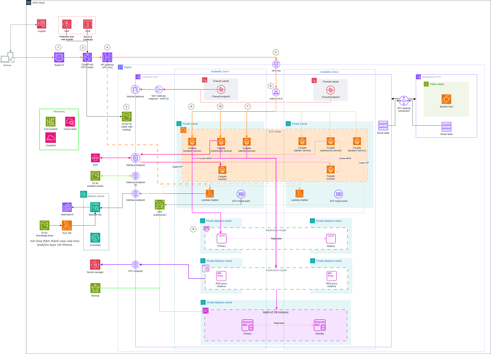

---

### 2.3 W4 Feedback Resolution

**Feedback nhận được từ W4:** `Không có related feedback`

**W5 giải quyết thế nào:**
  * `khác so với kiến trúc các tuần trước là áp dụng thêm 1 vpc riêng để bastion host vào hệ thống`
  * `sử dụng thêm rds proxy để tái sử dụng connection tốt hơn, tránh exhausted connection,  db "chịu tải" tốt hơn`
  * `sử dụng bedrock để làm chatbot dựa trên aws s3 vector và thông qua opensearch để tìm kiếm`
  * `sử dụng aws backup để backup hệ thống`
  * `có set-up thêm firewall endponit -> thêm 1 lớp bảo vệ hệ thống trước khi outbound lại từ nat-gateway`

---

### 2.4 Bedrock Retrieval vẫn hoạt động

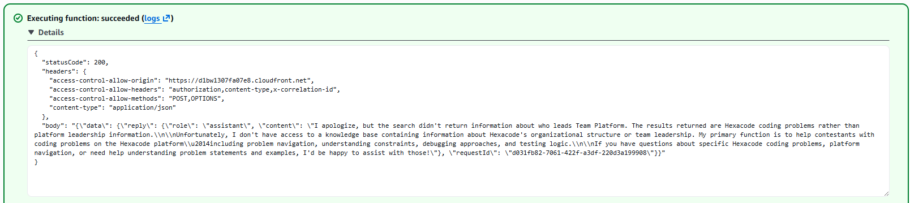

**note:**
`Lambda invoke Bedrock KB, trả về câu trả lời đúng với source citation.`

---

### 2.5 Database Query vẫn hoạt động


<sub>Note: Query chạy được trên RDS, trả về data thật.</sub>

---

## 3. MH1 — Multi-VPC Connectivity

### 3.1 Lựa chọn Path

**Path đã chọn:** `Path A — VPC Peering`

**Rationale:**
`Nhóm chọn Path A — VPC Peering để kết nối giữa Management VPC và hexacode-prod-vpc`
`Lí do: Hệ thống hiện tại có hai VPC với dải CIDR không chồng lấn (10.0.0.0/18 và 10.20.0.0/16). VPC Peering là giải pháp tối ưu nhất về chi phí và hiệu năng cho kết nối point-to-point trực tiếp, cho phép Bastion Host từ Management VPC có thể truy cập và quản trị các dịch vụ trong môi trường Production một cách bảo mật qua đường mạng nội bộ của AWS.`

**Peering Connection**

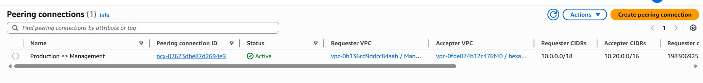

**2 VPC**

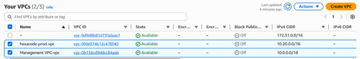

**note:**
`Xác nhận cấu hình 2 VPC riêng biệt (Management & Production) với dải CIDR không trùng lặp (10.0.0.0/18 và 10.20.0.0/16) sẵn sàng cho kết nối Peering.`


---

### 3.2 Route Table 

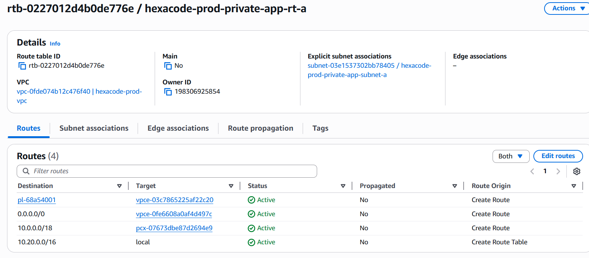

**note:**
`Cấu hình Route Table tại Private Subnet A (Prod VPC), điều hướng traffic đến Management VPC qua Peering Connection (pcx-0767...).`

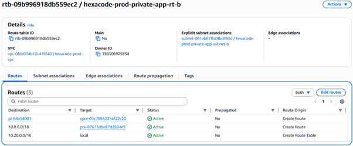

**note:**
`Đảm bảo tính Multi-AZ bằng việc cập nhật Route Table tại Private Subnet B trỏ về Management VPC qua Peering.`

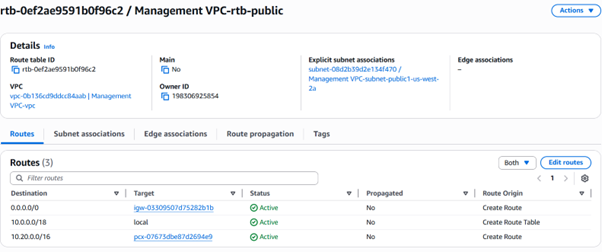

**note:**
`Cấu hình Route Table tại Management VPC trỏ ngược về dải IP 10.20.0.0/16 của Prod VPC để hoàn tất kết nối 2 chiều.`

---

### 3.3 Connectivity Test (curl hoặc ping cross-VPC)

```bash
curl -v http://10.20.11.96:8000
10.20.11.96: Private IP của identity-service 
8000: port
```

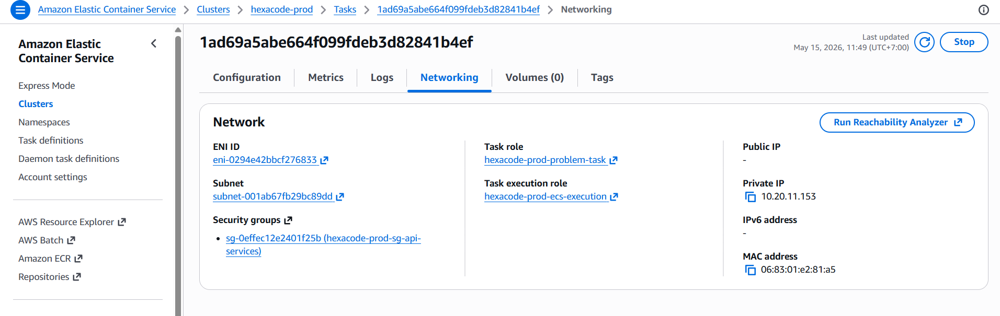

**note:**
`Kiểm tra kết nối thực tế từ Bastion Host (Management VPC) tới App (Prod VPC). Trạng thái HTTP 200 xác nhận lớp Network đã thông suốt (Reachability OK).`

**Result:**

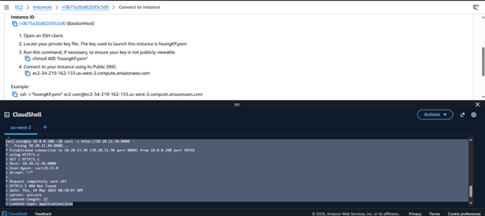

---

### 3.4 VPC Flow Logs — Bật và có sample entry

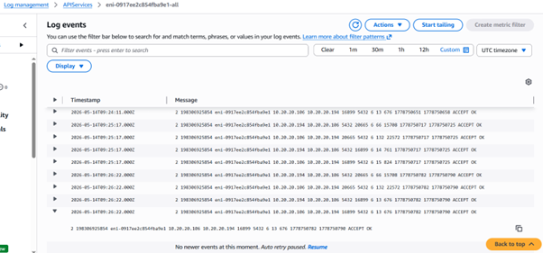

**note:**
`Flow Logs tại Prod VPC hiển thị trạng thái 'ACCEPT OK' với action là 'accept' và log-status là 'ok' cho lưu lượng đến từ IP 10.0.0.208 của Management VPC.
=> traffic được cho phép và log thành công`

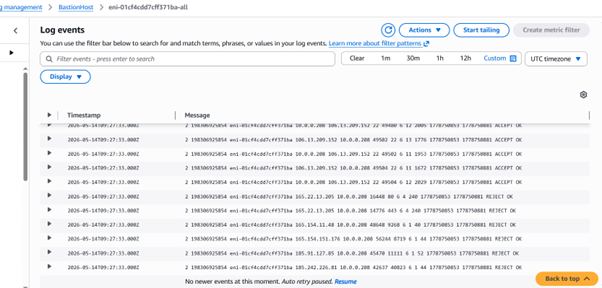

**note:**
`Quan sát và giám sát toàn bộ traffic đi ra từ Bastion Host, đáp ứng yêu cầu tính Observability của Network Fortress.`

---

## 4. MH2 — Network Firewall Hardening

### 4.1 Lựa chọn Path

**Path đã chọn:** `Path A — AWS Network Firewall`

**Rationale:**
`Ứng dụng của nhóm có các dịch vụ chạy trong Private Subnet (ECS/Lambda)cần truy cập internet để có thể gọi 1 số api bên ngoài chẳng hạn như lấy data problemset từ 1 bên thứ 3 nào đó để phục vụ enrich data cho hệ thống or tải các thư viện cần thiết thông qua NAT Gateway. Ngoài ra cũng hạn chế được các trường hợp đặc biệt như hacker cố tải malware từ bên ngoài hệ thống. Do đó, nhóm triển khai AWS Network Firewall tại biên VPC để thực hiện kiểm tra lưu lượng (Traffic Inspection). Việc này cho phép chúng em áp dụng chính sách 'Stateful Rule' (Domain-based filtering) để chỉ cho phép traffic tới các domain hợp lệ (như .amazonaws.com), ngăn chặn rủi ro rò rỉ dữ liệu (Data Exfiltration) và chặn các kết nối tới máy chủ độc hại từ bên trong hệ thống.`

---

### 4.2 Cấu hình Firewall 

**Path A — Network Firewall:**

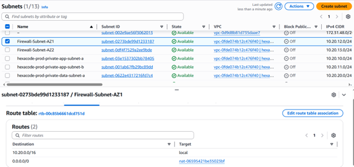

**note:**
`Thiết lập Route Table riêng cho Firewall Subnet tại AZ1, điều hướng traffic 0.0.0.0/0 tới NAT Gateway để đảm bảo mọi luồng traffic đi ra internet đều phải đi qua chốt kiểm soát.`

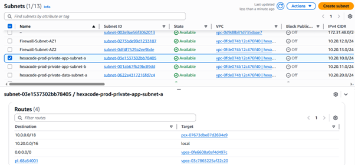

**note:**
`Cấu hình Route Table cho tầng Application, sử dụng VPC Peering cho traffic nội bộ và VPC Endpoints để truy cập các dịch vụ AWS một cách bảo mật.`

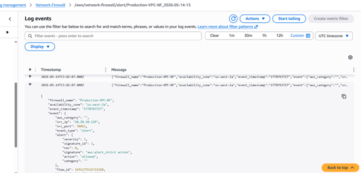

**note:**
`CloudWatch Logs ghi nhận chi tiết hành động (Action: Allowed) và thông tin IP nguồn/đích của traffic đi qua Firewall, đảm bảo tính Observability.`

---

### 4.3 Request được cho phép (ACCEPT)


**note:**
`Quan sát và giám sát toàn bộ traffic đi ra từ Bastion Host, đáp ứng yêu cầu tính quan sát (Observability) của Network Fortress.`

---

### 4.4 Negative Test — Request bị chặn (DENY/REJECT)


**note:**
`Quan sát và giám sát toàn bộ traffic đi ra từ Bastion Host, đáp ứng yêu cầu tính quan sát (Observability) của Network Fortress.`

---

## 5. MH3 — File Storage Layer + Backup Plan

### 5.1 EFS File System — Đã tạo và mount

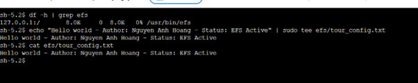

**note:**
`Kiểm tra hệ thống file mount thành công (df -h) và thực hiện ghi dữ liệu cấu hình thật của ứng dụng (tour_config.txt) lên Amazon EFS từ terminal.`

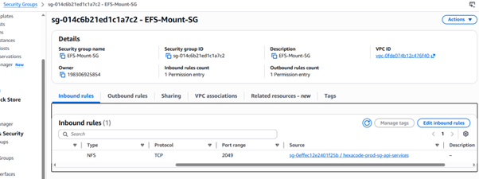

**note:**
`Hardening lớp lưu trữ: Security Group của EFS chỉ cho phép truy cập cổng 2049 từ Security Group cụ thể của tầng API Services, tuân thủ nguyên tắc Least Privilege.`

---

### 5.2 Resource Assignment for Backup

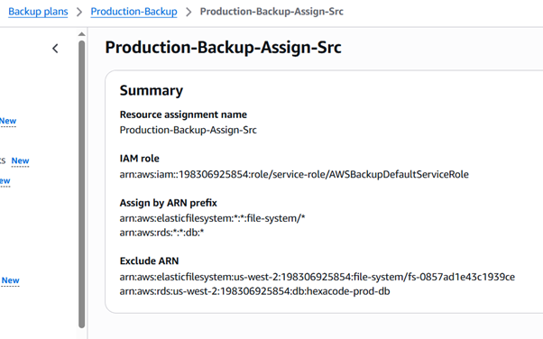

**note:**
`Cấu hình Backup Plan tự động nhận diện tài nguyên dựa trên ARN prefix, bao phủ toàn bộ hệ thống File System và Database của ứng dụng.`

---

### 5.3 AWS Backup Plan

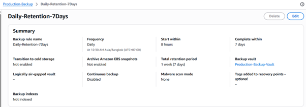

**note:**
`Thiết lập chính sách sao lưu hàng ngày (Daily) với thời gian lưu trữ 7 ngày, đảm bảo khả năng phục hồi dữ liệu trong vòng 1 tuần.`

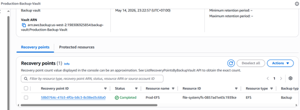

**note:**
`Hệ thống đã tạo thành công điểm khôi phục (Recovery Point) cho Prod-EFS, xác nhận dữ liệu đã được lưu trữ an toàn vào Backup Vault.`

---

### 5.4 Restore Test 

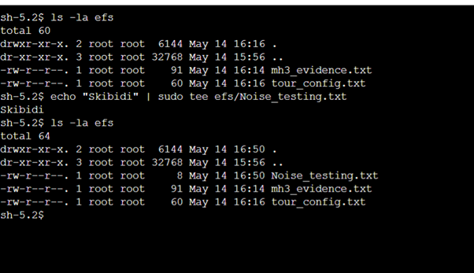

**note:**
`Add thêm file (Noise_testing.txt) vào EFS sau khi đặt Recovery point`

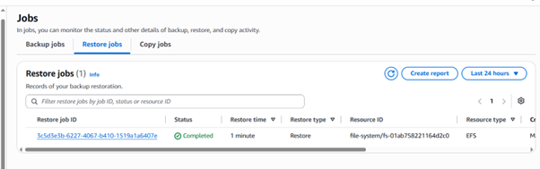

**note:**
`Bằng chứng quan trọng nhất: Restore Job ID [3c5d3...] đã hoàn thành trạng thái 'Completed', chứng minh kế hoạch khôi phục hoạt động thực tế.`

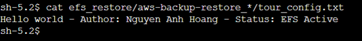


**note:**<br>
`- Thực hiện mount File System vừa được khôi phục vào thư mục efs_restore để đối soát dữ liệu gốc.`<br>
`- Lệnh cat cho thấy nội dung file sau khi khôi phục hoàn toàn trùng khớp với dữ liệu gốc. Restore Test thành công 100%.`

---

## 6. MH4 — API Gateway trước Lambda

### 6.1 Throttling — Usage Plan với Rate Limit

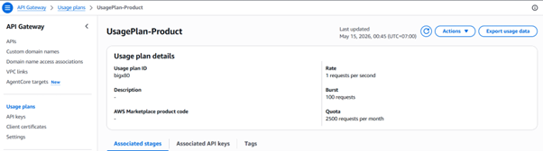

**note:**
`Thiết lập Usage Plan với Rate Limit 1 requests/giây để bảo vệ tài nguyên Lambda bên dưới khỏi các đợt bùng phát traffic (Spike traffic).`

---

### 6.2 Authentication Configuration

**Auth method đã chọn:** `Cognito User Pool Authorizer`

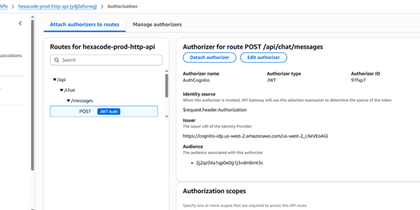

**note:**
`Surface API bảo mật: Tích hợp Cognito Authorizer yêu cầu JWT Token hợp lệ cho mọi request tới endpoint /api/chat/messages.`

---

### 6.3 Before Login

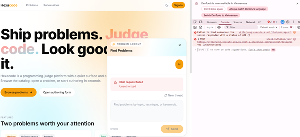

**note:**
`Kiểm chứng bảo mật: Khi truy cập từ trình duyệt mà không có Token hợp lệ, API Gateway trả về lỗi 401 Unauthorized, chặn đứng truy cập trái phép tại biên.`

---

### After Login

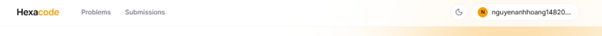
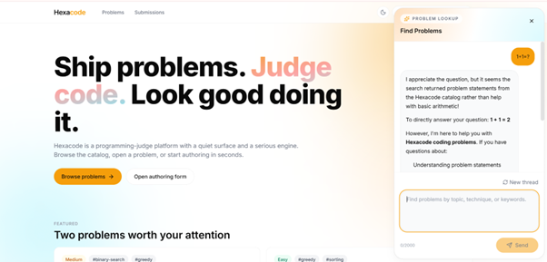

**note:**
`Giao diện sau khi login thành công.`

---

## 7. MH5 — Serverless Scaling Pattern

### 7.1 Pattern đã chọn

**Pattern:** `Reserved Concurrency` &nbsp;&nbsp; `Provisioned Concurrency`

**Function áp dụng:** `hexacode-prod-chat`

**Rationale:** `Nhóm áp dụng chiến lược Hybrid Concurrency để tối ưu hóa cả tính an toàn và hiệu năng:`<br>
`- Reserved Concurrency (Limit = 2): Đóng vai trò là 'lớp bảo vệ biên', ngăn chặn việc function này tiêu tốn quá mức hạn mức của AWS Account nếu xảy ra spike traffic đột ngột hoặc lỗi loop, đồng thời giúp kiểm soát chi phí gọi API Bedrock.`<br>
`- Provisioned Concurrency (Level = 1 hoặc 2): Vì đây là tính năng Chat AI yêu cầu phản hồi tức thì, nhóm sử dụng Provisioned Concurrency để duy trì các môi trường thực thi luôn ở trạng thái 'ấm' (warm). Việc này giúp loại bỏ hoàn toàn độ trễ Cold Start (~500ms), mang lại trải nghiệm mượt mà nhất cho người dùng cuối.`

---

### 7.2 Cấu hình Pattern

**Reserved Concurrency:**

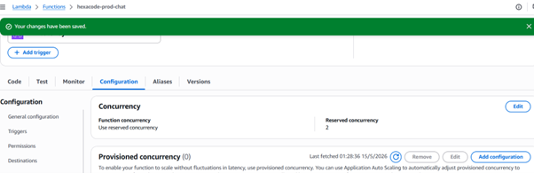

**note:**
`Nhóm thiết lập Reserved Concurrency cho Lambda function hexacode-prod-chat ở mức bằng 2. Cấu hình này nhằm giới hạn số lượng thực thi đồng thời, giúp bảo vệ hạn mức (account limit) và mô phỏng hành vi giới hạn tải trong môi trường Production.`

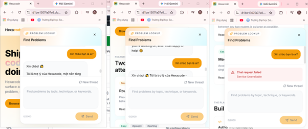

**note:**
`Thực hiện stress test bằng cách gửi 3 request đồng thời. Kết quả: 2 request đầu được xử lý thành công, request thứ 3 nhận lỗi "Service Unavailable" do vượt quá giới hạn thực thi đồng thời đã cấu hình. Đây là bằng chứng cơ chế chặn tải (Throttling) hoạt động chính xác.`

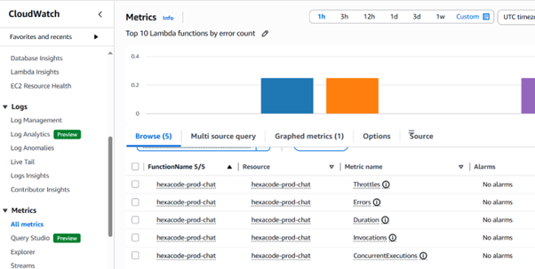

**note:**
`Biểu đồ CloudWatch ghi nhận rõ ràng các điểm Spike của metric 'Throttles' (cột màu xanh/cam). Điều này xác nhận hệ thống đã chủ động từ chối các request vượt ngưỡng để đảm bảo tính ổn định cho các thành phần khác.`

---

**Provisioned Concurrency:**

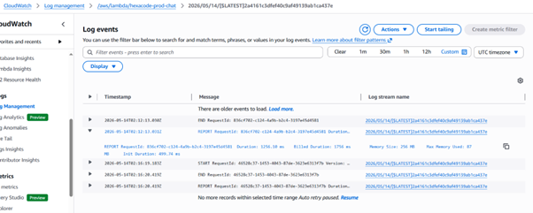

**note:**
`Init Duration cold-start: Init Duration: 499.74 ms `


**note:**
`Init Duration warm-start: 0627fb6a-5157-4d11-8d56-b6b99e5ed8ef	Duration: 4130.74 ms	Billed Duration: 4131 ms	Memory Size: 256 MB	Max Memory Used: 88 MB	-> không có init duration`

---

## 8. Negative Security Tests

### 8.1 Network / Firewall — Request bị chặn

*(Dùng lại ảnh từ MH2 Section 4.4)*

`[Mô tả attempt: từ đâu, đến đâu, port mấy, kết quả gì]`

---

### 8.2 EFS — Truy cập từ instance không thuộc app-tier SG bị từ chối


<sub>Note: Mount NFS từ instance ngoài app-tier SG → Connection timed out. Xác nhận EFS mount target SG đang enforce đúng.</sub>

---

### 8.3 API Gateway — Unauthenticated request bị từ chối

*(Dùng lại ảnh từ MH4 Section 6.5)*

`[HTTP 403 Forbidden — API Gateway enforce auth trước khi traffic chạm Lambda]`

---

## 9. Stretch Goals *(Tùy chọn)*

> Chỉ điền nếu đã hoàn tất cả 5 must-haves và Evidence Pack.

### 9.1 `[ ]` VPC Reachability Analyzer


<sub>Note: Path analysis pass — connectivity đúng.</sub>


<sub>Note: Sau khi cố ý break route table, Reachability Analyzer phát hiện được lỗi.</sub>

---

### 9.2 `[ ]` Backup Vault Lock


<sub>Note: Vault Lock ở Compliance Mode — retention period, không IAM principal nào xóa được recovery point trước khi hết hạn.</sub>

---

### 9.3 `[ ]` Lambda Power Tuning


<sub>Note: Kết quả chạy với nhiều mức memory — điểm tối ưu cost-performance là bao nhiêu MB và tại sao.</sub>

---

### 9.4 `[ ]` API Gateway Custom Domain


<sub>Note: Custom domain với ACM certificate gắn vào stage API Gateway.</sub>

---

### 9.5 `[ ]` CloudFormation Template cho một resource W5

```yaml
# Paste CFN template snippet ở đây
```


<sub>Note: `aws cloudformation validate-template` output — template pass validation.</sub>

---

*— End of W5 Evidence Pack —*
